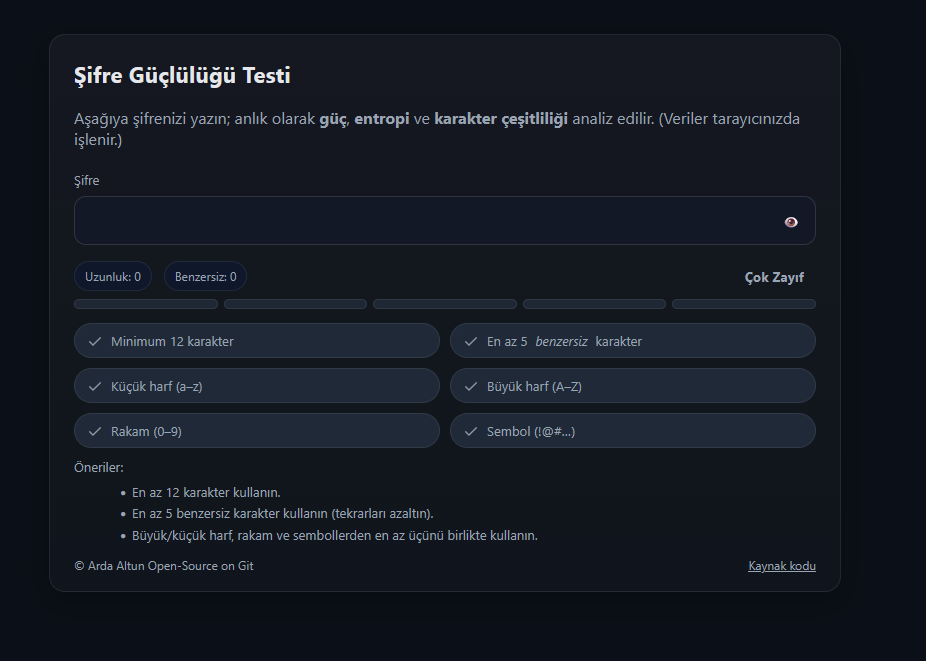

# Şifre Güçlülüğü Testi (Password Strength Meter)

Modern, hafif ve bağımsız çalışan bir **şifre güçlülüğü ölçer**.  
`main.html` + `main.js` ile gelir; ek kütüphane gerektirmez. Anlık olarak **uzunluk**, **benzersiz karakter sayısı**, **karakter çeşitliliği**, **entropi**, **ardışık kalıplar** ve **yaygın şifreler** gibi birçok kriteri değerlendirir.

---

## Ekran Görüntüsü
<p align="center">
  
</p>

---

## Özellikler

- **Gerçek zamanlı analiz** (input event’leriyle)
- **Entropi hesabı** (yaklaşık L·log₂(N))
- **Çeşitlilik kontrolleri**: küçük/büyük harf, rakam, sembol
- **Tekrar & ardışık dizi** cezaları (aaa, 123, qwerty, takvim/yıl vb.)
- **Yaygın şifre** listesi + leet normalizasyonu (`p@ssw0rd` → `password`)
- **Görsel seviye göstergesi** (5 bar) ve “Çok Zayıf → Çok Güçlü” etiketi
- **Erişilebilirlik** (aria-live, odak stilleri)
- **Kolay özelleştirme** (minimum uzunluk, benzersiz karakter, yasaklı liste…)
- **Bağımsız**: Sadece `main.html` ve `main.js`

---

## Dizin Yapısı

```text
.
├─ main.html
└─ static/
   └─ main.js   
